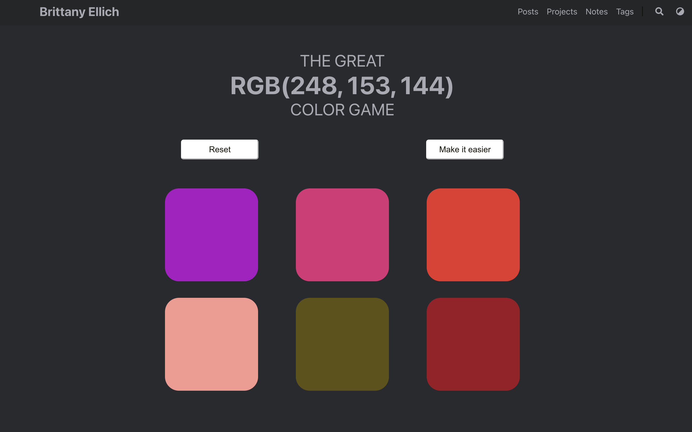
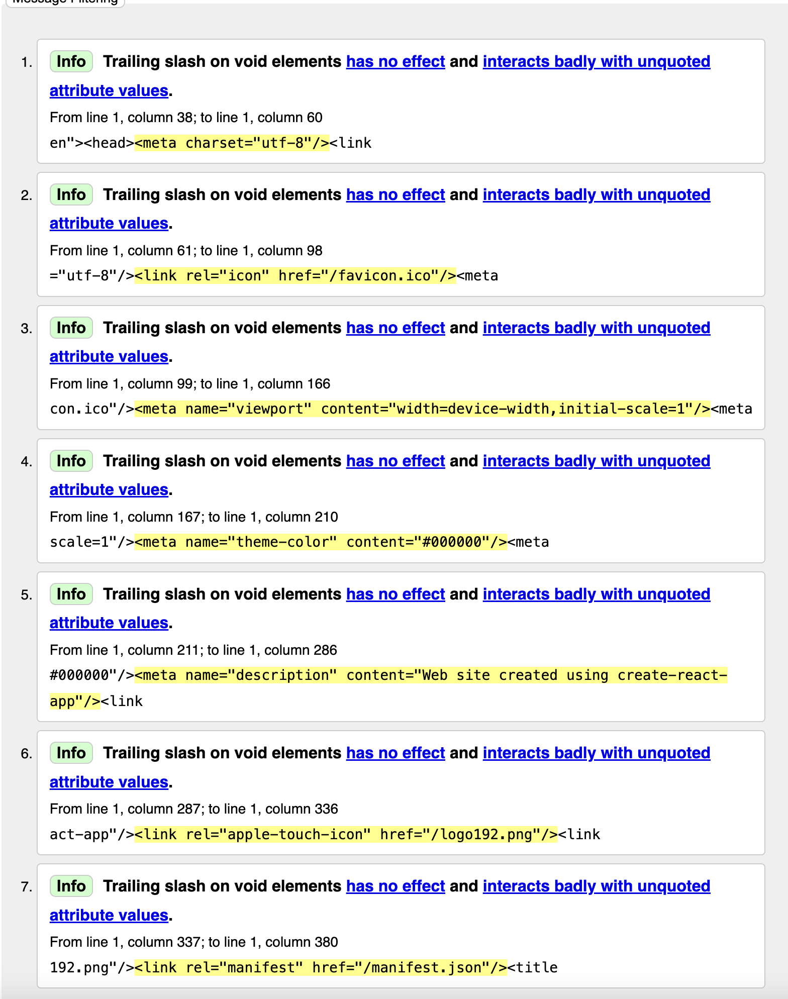
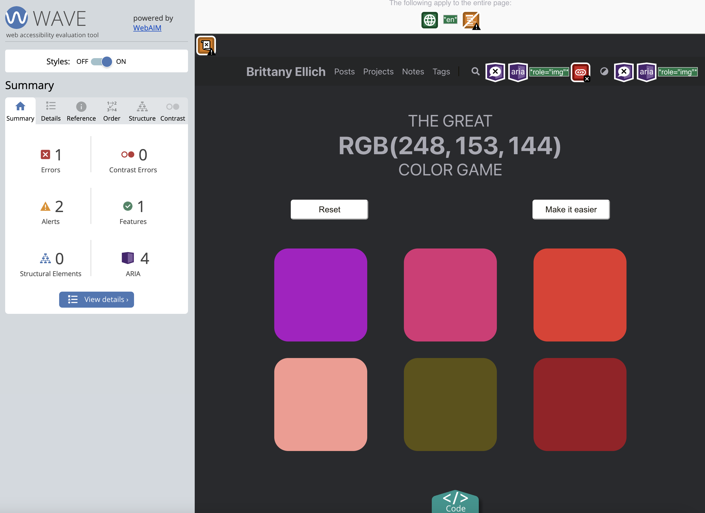
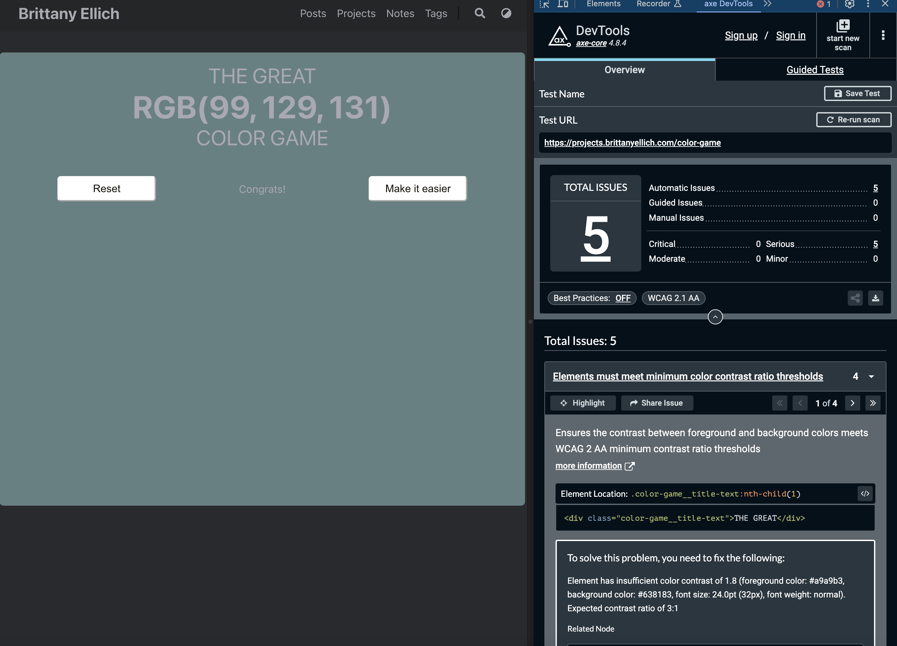
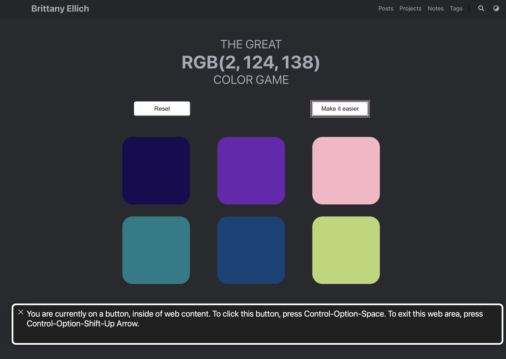

# Demo of Building a More Accessible Experience

When preparing for this presentation I originally planned to create a demo project that would showcase some common poorly accessible patterns. Fortunately (or unfortunately) I already had a treasure trove of personal projects that I could use instead!

The project that I am working through as part of this demo is called The Color Game. The game presents a RGB value and either 3 or 6 color options to choose from. The goal of the game is to guess which color matches the RGB value.



I made this page a few years ago when I was last preparing for a job search. It was a rebuild of a project that I had completed for an introductory React course from Colt Steele on Udemy that I threw together in a few hours, as I felt that I needed some projects on my site to prove that I knew how to make things.

## Testing Checklist

While [this accessibility testing checklist](./testing-checklist.md) is not exhaustive, it was a good starting point to test the web page for accessibility. Here are the items that I tested and what was found as a result.

### HTML Validation

I ran the site through [HTML validation on this web page](https://validator.w3.org/nu), which produced the following output in the image below. The issues were all related to trailing slashes on void HTML elements and produced no errors or warnings. So far, so good!



### Automated Accessibility Scan - WAVE

The next step in the checklist is an automated accessibility scan using [the web accessibility evaluation tool chrome extension (WAVE)](https://chromewebstore.google.com/detail/wave-evaluation-tool/jbbplnpkjmmeebjpijfedlgcdilocofh). The results of this scan are in the image below. This showed a single error, due to the icon button that didn't provide link information, as well as a lack of a H1 heading and a noscript tag on the page. Good information to find, but again not a scary amount of changes!



### Automated Accessibility Scan - Axe Devtools

The third item I added to the checklist is to do another automated scan, this time from [the Axe Devtools chrome extension](https://www.deque.com/axe/devtools/). This scan didn't produce any issues. I decided to try and run the scan again using the "winning" state of the game, where the background color changes to the winning RGB color. In that state, Axe Devtools found issues with color contrast between the text and the background color.



### Screen reader check and keyboard navigation

I ran through the page quickly with the Voiceover screen reader on MacOS, navigating with my keyboard. This meant running Voiceover and using my `tab` key a lot to see whether I could navigate to each feature and where the focus was. This is where the problems really started to show themselves... I couldn't navigate to any of the color blocks, making this page completely unusable! The culprit: I made the color blocks `<div>`s when they should have been `<button>`s.



### Mouse/Touch, Timing, and Media

All of these three categories really didn't have much that needed to be addressed.

### Visual

This checklist item unveiled another issue, specifically in the `Color alone doesn't convey information` section. Color alone is literally the only thing that was conveying information on the color blocks, making this site very difficult for anyone to navigate that experiences colorblindness.

### Semantic HTML check

Other than the areas already called out (using buttons instead of divs), one section that seemed like a potential issue was the lack of information on the page about both the game and about what RGB is.

## Summary of Problems

After testing, here is the summary of all of the areas that needed to be addressed:

* Clean up trailing slash warnings
* Remove or fix search icon
* Create skip link for navigation
* Add h1 to match title
* Explain what RGB is and what the goal of the game is
* Fix color contrast on page title
* Make colors keyboard navigable and read out on a screen reader
* Add a name for each color that can be read by people experiencing low vision

## Fixing things

I skipped fixing the first three items, since they were more related to the overall project structure. I will plan to fix them at a later date. Here is a summary of the rest of the changes that I made:

### Add h1 to match the title

Instead of having one giant div for the title, I added an h1 and h2 to contain the page title and to list the RGB value, which went from this:

```html
<div className="color-game__title">
    <div className="color-game__title-text">THE GR
EAT</div>
    <div className="color-game__title-color-text">
        RGB({colors[correctIndex][0]}, {colors[correctIndex][1]},{" "}
        {colors[correctIndex][2]})
    </div>
    <div className="color-game__title-text">COLOR GAME</div>
    </div>
```

to this:

```html
<h1 className="color-game__title">The Great RGB Color Game</h1>
<h2 className="color-game__title-color-text">RGB({colors[correctIndex][0]}, {colors[correctIndex][1]},{" "}
    {colors[correctIndex][2]})</h2>
```

### Explain what RGB is and the goal of the game

I added a paragraph explaining RGB and what the game was, to make the overall page more understandable. I ran this paragraph through [hemingwayapp.com](hemingwayapp.com), which gave me a reading level of Grade 2.

```html
<p>RGB (Red, Green, Blue) is a color model used to create a vast variety of colors by combining red, green, and blue (the three primary colors of light) together to create a large variety of colors. The goal of this game is to take the RGB value below and guess which of the color block options corresponds to the value. Each RGB value can be between 0 and 255. As a hint, the larger the number, the more of that value is present. <a href="https://en.wikipedia.org/wiki/RGB_color_model">Learn more about RGB values here!</a></p>
```

### Fix color contrast

Instead of changing the color of the entire page background upon winning the game, I moved the style tag to just the section of the page that the color buttons are in.

```html
// Move style tag to color-game__play-area div
// Add the following CSS to color-game__play-area:

padding: 16px;
border-radius: 16px;
margin-bottom: 32px;
```

### Make color blocks keyboard navigable

Turning the divs into buttons made the color blocks navigable from the keyboard. I also added a border around the buttons to make the styling a bit easier to see.

```html
// Turn the divs into buttons
// Add the following styles to the buttons:
.dark {
 .color-game-block-accessible {
   border: 4px solid #a9a9b3;
 }
}
.light {
 .color-game-block-accessible {
   border: 4px solid #161209;
 }
}
```

### Add a name for each color

To add a name to each color, I found a library that takes a hex value for a color and finds the closest color name for it. It isn't perfect, quite a few colors default to `black`... But it is a starting point!

```html
// Add name that color.js: https://chir.ag/projects/ntc/
// Compute hex value for each color
// Add Color type
// Add styles for button text:
       color: "white",
       fontWeight: "bold",
       fontSize: "1.5rem",

```

## Results

Finally, here are the results of the change! You can see [the original game here](https://projects.brittanyellich.com/color-game) and [the more accessible version of the game here](https://projects.brittanyellich.com/color-game-accessible).

It certainly isn't perfect, and could probably use a bit more work. But it's in a much better state than it was in originally!
